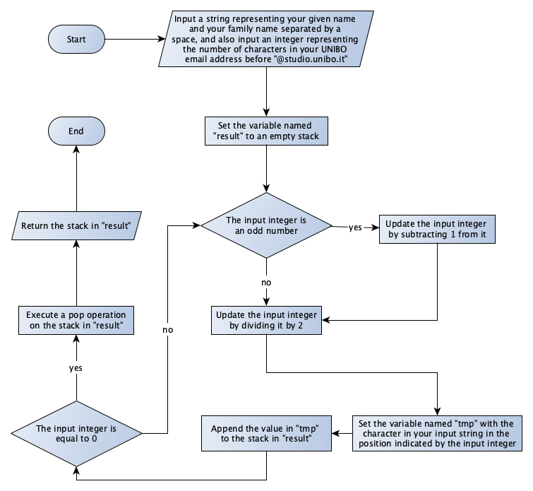

# First partial examination

## Quick questions - take 1

### Question 1
Complete the following sentences:

A ​list is a {{choose}} collection of {{choose}} and {{choose}} elements. A set is a {{choose}} collection of {{choose}} and {{choose}} elements. A stack is a {{choose}} collection of {{choose}} and {{choose}} elements.

Possible terms to choose: countable, non-repeatable, ordered, repeatable, uncountable, unordered

*Answer:* A ​list is a countable collection of ordered and repeatable elements. A set is a countable collection of unordered and non-repeatable elements. A stack is a countable collection of ordered and repeatable elements.

### Question 2
Which of the following names refer to the concept of a Turing Machine:

* cells
* final states
* finite memory tape
* head
* infinite memory tape
* initial state
* table of instructions
* the symbols "0" and "1"
* theoretical machine
* triangles

*Answer:* cells, final states, head, infinite memory tape, initial state, table of instructions, the symbols "0" and "1", theoretical machine

### Question 3
Which contruct would you use in Python to implement a decision widget in a flowchart?

*Answer:* An if-else block.


## Quick questions - take 2

### Question 1
A Turing Machine is composed of an {{choose}} containing {{choose}}, each containing a symbol that can be {{choose}} by the {{choose}} of the machine. The {{choose}} of the machine at a specific time is recorded. The machine specifies the possible actions to perform in a {{choose}}.

Possible terms to choose: cells, finite memory tape, finite table of instructions, head, infinite memory tape, infinite table of instructions, pushed and popped, read and written, state, triangles
   
*Answer:* A Turing Machine is composed of an infinite memory tape containing cells, each containing a symbol that can be read and written by the of the head machine. The state of the machine at a specific time is recorded. The machine specifies the possible actions to perform in a finite table of instructions.

### Question 2
Which of the following names refer to widgets in a flowchart:

* decision
* engine
* flowline
* foreach 
* input / output
* instruction
* machine
* process
* terminal
* while

*Answer:* decision, flowline, input / output, process, terminal.

### Question 3
In which way would you implement a for each loop in a flowchart?

*Answer:* By using a decision widget which enables to follow a path that will bring the algorithm to the same decision widget.


## Understanding

Execute the algorithm described in the flowchart, and answer with the output returned by that execution.

</img>

*Answer:* Using, as input, the string `"John Doe"` and `8` (counting the number of charaters in the email `"john.doe@studio.unibo.it"` that preceeds the string `"@studio.unibo.it"`), and considering the positions in the string starting from 0, the execution of the flowchart returns the following stack:

```
"o"
"h"
" "
```

## Development

Write the body of the following Python function:

```
def solve(n1, n2, n3):
    # to complete
```

The function takes three positive integers in input representing the maximum values that can be specified in the dials of the combination lock shown in the following picture, where `n1` refers to the first dial on the left, `n2` refers to the central dial, and `n3` refers to the dial on the right:

</img>

In particular, if any of the input integers is n it means that the related dial of the lock can assume any number from *0* to *n* included (e.g. if `n1` is *4*, one can specify any number among *0*, *1*, *2*, *3*, and *4* in that dial). In order to check, in the body of your function, if a certain combination opens the lock, you can use an external function `open_it(comb)` (provided, not to be implemented) that takes in input a tuple of three non-negative integers defining a particular combination and return `True` if the combination opens the lock, `False` otherwise.

The function solve must return the tuple of the combination that opens the lock.

*Answer:*

```
def solve(n1, n2, n3):
    for i in range(n1 + 1):
        for j in range(n2 + 1):
            for k in range(n3 + 1):
                if open_in((i, j, k)):
                    return i, j, k
```