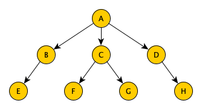

# Second partial examination

## Quick questions

### Question 1
What does the following figure represent?



* an undirected graph
* a set
* a stack
* a list
* a tree
* a queue
* a dictionary
* a directed graph

*Answer:* a directed graph


### Question 2
*Complete the following text by dragging four of the text boxes below in the appropriate position.*

Any divide and conquer algorithm is based on the following steps:

1. [drag an item here]
2. [drag an item here]
3. [drag an item here]
4. [drag an item here]

Possible texts to choose:
* reconstruct the final solution of the problem using the partial solutions obtained from running the algorithms on the smaller parts of the input material 
* if the current node is a leaf, but it is not a solution to the problem, then return no solution to the parent node, otherwise 
* apply the whole approach recursively for each child of the current node, until one of these recursive executions returns a solution. If none of them provides a solution, return no solution to the parent node of the current one 
* return the solution calculated previously to the problem if this is the case, otherwise 
* split the input material into two or more balanced parts, each representing a sub‑problem of the original one 
* if the current node is a leaf, and it represents a solution to the problem, then return the sequence of all the moves that have generated the successful situation, otherwise 
* run the same algorithm recursively for every balanced part obtained in the previous step 
* address the problem directly on the input material if it is depicting an easy‑to‑solve problem, otherwise 
* store the solution to the problem to reuse if needed by other recursive calls

*Answer:*
1. address the problem directly on the input material if it is depicting an easy‑to‑solve problem, otherwise 
2. split the input material into two or more balanced parts, each representing a sub‑problem of the original one 
3. run the same algorithm recursively for every balanced part obtained in the previous step 
4. reconstruct the final solution of the problem using the partial solutions obtained from running the algorithms on the smaller parts of the input material 

### Question 3
When can we claim that an algorithm has a recursive behaviour?

*Answer:* When it has one or more ​basic cases and at least one ​recursive step​.


### Question 4 (Understanding)
Consider the following Python function:

```
def f(name):
    result = set()
    for c in get_odd_numbers(name):
        result.add(name[c])
    return result
```

The ancillary function `get_odd_numbers` takes in input a string and returns a list of numbers referring to the odd positions of the characters in the input string. What is the result of the execution of `f("Santa Claus")`?

*Answer:* `{"a", "t", " ", "l", "u"}`


## Development

Write down, using a **divide and conquer approach**, the body of the following Python function:

```
def sum(number_list) 
```

The function takes a list of numbers as input and returns their sum. The use of any form of iteration (e.g. for each and while loops) is prohibited.


*Answer:*
```
def sum(number_list):
    list_len = len(number_list)
    
    if list_len == 0:
        return 0
    elif list_len == 1:
        return number_list[0]
    else:
        mid = list_len // 2
        return sum(number_list[:mid]) + sum(number_list[mid:])
```
